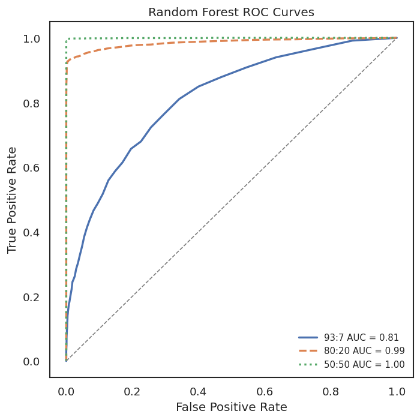
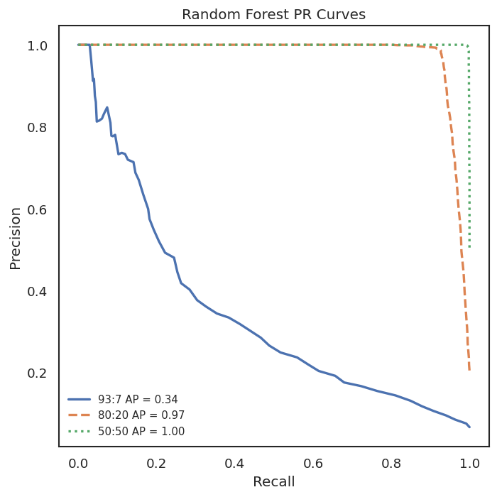

# Predicting Financial Distress Using ML
This project explores the application of machine learning techniques to predict financial distress (i.e., bankruptcy). The goal is to assess & identify the most effective model among several ML techniques and evaluate their performance against the Altman Z-score, a traditional financial distress prediction metric.

## Project Overview 
The following models were implemented & compared:

- Logistic Regression 
- Random Forests 
- Neural Networks
- XGBoost

## Dataset

**Source**: [Kaggle - US Company Bankruptcy Prediction Dataset](https://www.kaggle.com/datasets/utkarshx27/american-companies-bankruptcy-prediction-dataset).

The dataset contains financial information from publicly listed companies on the NYSE and NASDAQ, covering the years **1999 to 2018**.
- **8,262** unique companies
- **78,682** observations (firm-year combinations)
- Includes various financial metrics such as current assets, depreciation, cost of gold, etc. (see Kaglle for full list)

**Target Variable**
- 1: Bankrupt (filed under chapter 11 or chapter 7)
- 0: Not bankrupt

> **NOTE**: The dataset file is not included in this repository. Please download it from the Kaggle link above.

## How To Run

**Requirements**:
- Python 3.x
- Libraries: `pandas`, `numpy`, `matplotlib`, `scikit-learn`, `xgboost`
- Any notebook enviroment: e.g., Jupyter or Google Colab

**Steps**:
1. Clone this repository 
2. Download the dataset from Kaggle ([here](https://www.kaggle.com/datasets/utkarshx27/american-companies-bankruptcy-prediction-dataset))
3. Open the notebook file: `Predicting Financial Distress Using ML.ipynb`. 
4. Run all cells to reproduce the results

**Note**: This project was devloped & tested using Google Colab.

## Result Summary

Random Forest & XGBoost achieved the best results when trained on a balanced dataset (50:50 class split).
- **Best Accuracy**: 98.94%
- **False Positive Rate**: 1.96%
- **False Negative Rate**: 0.19%
- **AUC-ROC**: 1.00

  
  

